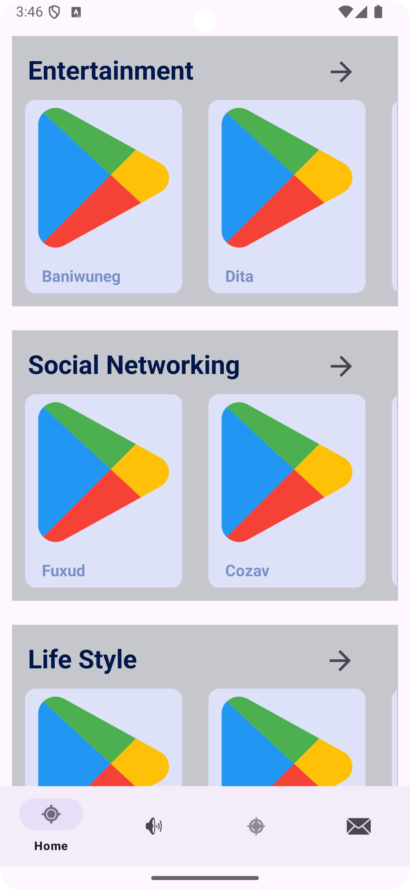
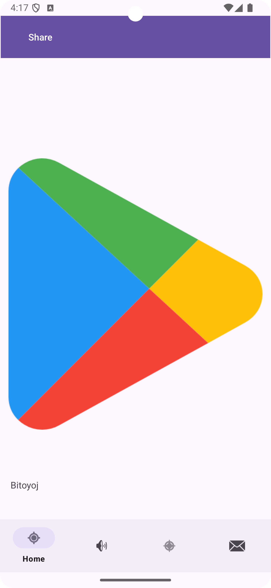
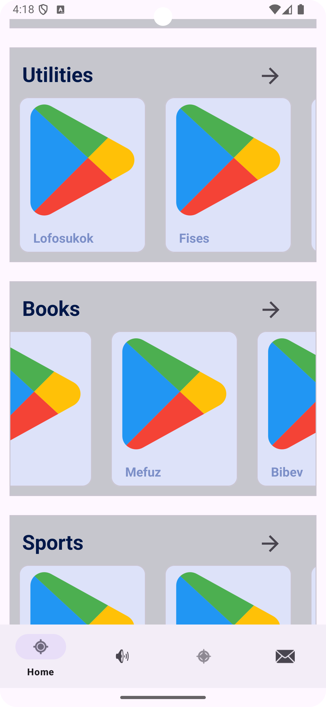

# Name der App

**(Optional) Füge hier einen kurzen, knackigen Slogan ein, um deine App zu bewerben.**

Beschreibe hier in ein paar Sätzen, was deine App bietet.

Für wen ist sie geeignet? Welches Problem löst sie? Was macht deine App anders / besser als andere Apps?
Vermeide es, hier allzusehr in technische Details zu gehen.

## Geplantes Design
Füge hier einige repräsentative Designs deiner App ein (z.B. aus Figma)

  
  
  

## Features
Hier kommen alle geplanten Features der App rein mit dem Status, ob es bereits umgesetzt wurde.

- [ ] Feature 1
- [ ] Feature 2
- [ ] ...

## Technischer Aufbau

#### Projektaufbau
Eine kurze Beschreibung deiner Ordnerstruktur und Architektur (MVVM, Repositories?) um Außenstehenden zu helfen, sich in deinem Projekt zurecht zu finden.

#### Datenspeicherung
Welche Daten speicherst du? Wo und wie (Firebase, Room)?

#### API Calls
Welche APIs verwendest du?

#### Dependencies
Es ist eine gute Praxis, die verwendeten Dependencies aufzulisten. Das gibt den Nutzern deines Projekts eine klare Vorstellung davon, was im Projekt verwendet wird.
- Retrofit 2.9.0 - Für Netzwerkoperationen
- Room 2.3.0 - Für lokale Datenbankverwaltung

## Ausblick
Beschreibe hier, wo die Reise nach deinem Praxisprojekt hin geht. Was möchtest du in Zukunft noch ergänzen? Erstelle auch hierzu Issues und verlinke sie, wie oben.
 
