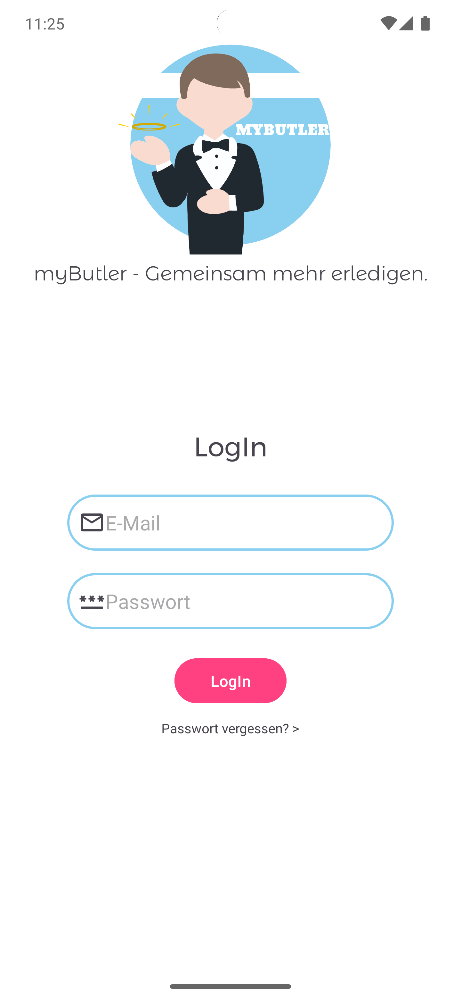
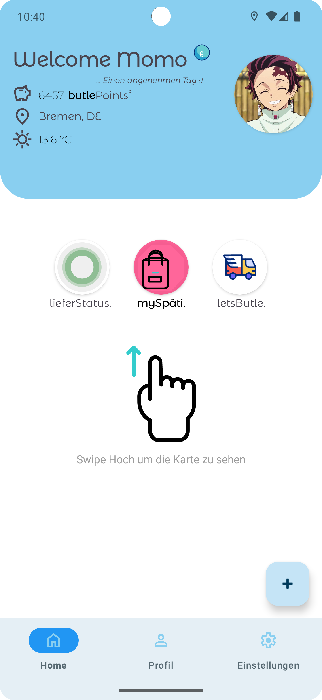
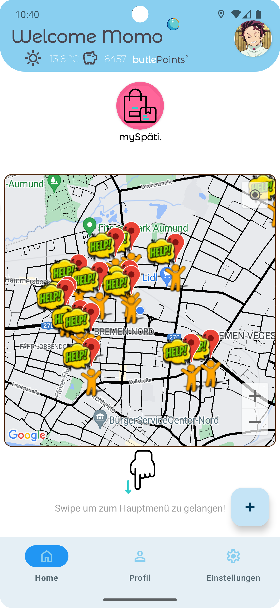
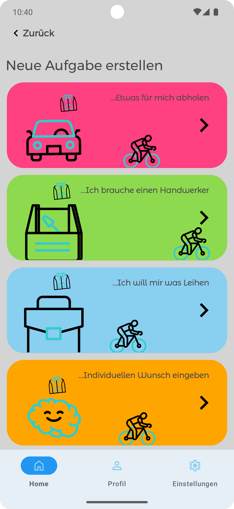
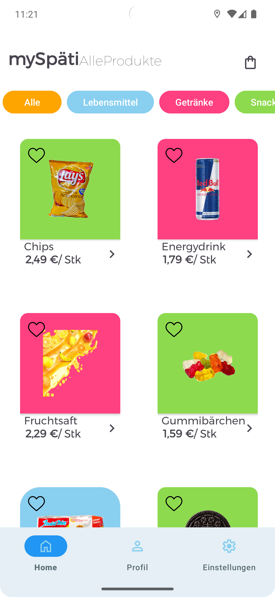
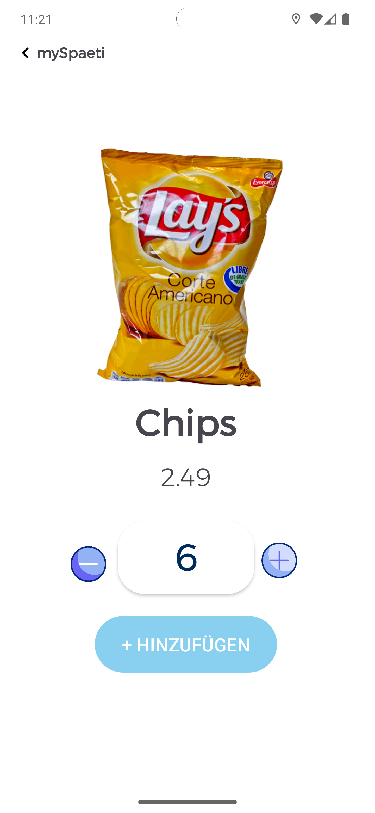
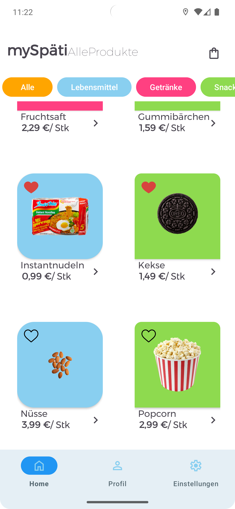
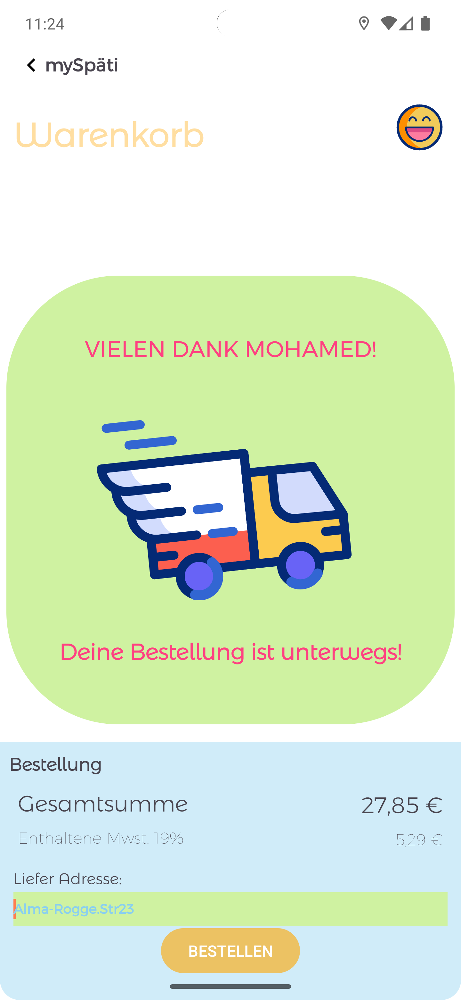

# myButler

**"myButler – Gemeinsam mehr erledigen"**

myButler ist eine community-gestützte App, die es Nutzern ermöglicht, Aufgaben zu veröffentlichen
oder anzunehmen. Ob kleinere Alltagsaufgaben oder spezielle Dienstleistungen – Dienstleister und
Auftraggeber können sich miteinander vernetzen. Für erledigte Aufgaben erhalten Nutzer
„butlePoints“, die sie wiederum für eigene Aufträge oder Auszahlungen nutzen können. Zusätzlich
bietet myButler mit mySpäti einen internen Lieferdienst für kleinere Städte, wo Nutzer Produkte
bequem nach Hause bestellen können. Die App zielt darauf ab, in kleinen Gemeinden den Alltag zu
erleichtern und die Community zu stärken.

## Geplantes Design

  
  
  
    

## Features

Hier kommen alle geplanten Features der App rein mit dem Status, ob es bereits umgesetzt wurde.

1. **Aufgaben veröffentlichen**: Nutzer können individuelle Aufgaben einstellen, die von anderen
   Mitgliedern der Community erledigt werden können.
2. **Aufgaben annehmen**: Dienstleister können Aufgaben auswählen und übernehmen, um „butlePoints“
   zu verdienen.
3. **Punkte-System (butlePoints)**: Für jede erledigte Aufgabe erhalten Nutzer Punkte, die sie
   entweder für andere Aufgaben verwenden oder auszahlen lassen können.
4. **Profilverwaltung**: Nutzer können ihr eigenes Profil erstellen und verwalten, inklusive
   Bewertungssystem für Dienstleister und Auftraggeber.
5. **Integrierter Shop – mySpäti**: Ein interner Lieferdienst für Produkte des täglichen Bedarfs,
   der speziell auf kleine Städte ausgerichtet ist.
6. **Benachrichtigungen**: Nutzer erhalten Echtzeit-Benachrichtigungen über neue Aufgaben oder
   Status-Updates zu laufenden Aufträgen.
7. **Filter- und Suchfunktionen**: Aufgaben und Dienstleister können nach Standort, Kategorie oder
   Dringlichkeit gefiltert werden.
8. **Chat-Funktion**: Direkte Kommunikation zwischen Dienstleister und Auftraggeber für bessere
   Koordination.
9. **Bewertungssystem**: Dienstleister und Auftraggeber können nach Abschluss der Aufgaben bewertet
   werden, um Vertrauen in der Community zu schaffen.
10. **Flexible Zahlungsmethoden**: Nutzer können Zahlungen einfach über die App abwickeln oder
    Punkte gegen Geld eintauschen.

## Technischer Aufbau

### 1. Projektaufbau

- **Modularer Aufbau**: Das Projekt ist in verschiedene Module gegliedert, um die Codebasis sauber
  und wartbar zu halten.
- **MVVM-Architektur**: Verwendung des Model-View-ViewModel-Patterns für eine klare Trennung von
  Logik und UI-Komponenten.
- **Jetpack Compose**: Moderne UI-Entwicklung mit deklarativer Programmierung für eine reaktive und
  flexible Benutzeroberfläche.
- **Dependency Injection**: Hilt wird zur Verwaltung von Abhängigkeiten verwendet, um die
  Testbarkeit und Modularität zu erhöhen.
- **Navigation Component**: Einfache und robuste Navigation zwischen den verschiedenen Ansichten in
  der App.

### 2. Datenspeicherung

#### Firebase (Cloud)

- **Firebase Realtime Database**: Speicherung und Synchronisation von Aufgaben, Benutzerprofilen und
  ButlePoints in Echtzeit.
- **Firebase Authentication**: Sichere Anmeldung und Authentifizierung von Nutzern per E-Mail,
  Google oder anderen Methoden.
- **Firebase Cloud Storage**: Speicherung von Mediendateien (z. B. Profilbilder, Rechnungen) in der
  Cloud.

#### Room (Lokal)

- **SQLite-Datenbank mit Room**: Lokale Datenbank für die Speicherung von Aufgaben,
  Profilinformationen und Verlauf, um Offline-Funktionalität zu gewährleisten.
- **Repository Pattern**: Kombiniert lokale und Remote-Datenquellen (Firebase und Room) für nahtlose
  Datenbereitstellung, sowohl online als auch offline.

### 3. API

#### OpenMeteo (Wetter-API)

- **Wetterdatenintegration**: Über die OpenMeteo-API werden lokale Wetterdaten in Echtzeit
  abgerufen, um wetterabhängige Aufgaben oder Empfehlungen zu geben.
- **REST-API**: Abruf der Daten erfolgt über HTTP-Requests mit Retrofit und verarbeitet
  JSON-Responses für Wettervorhersagen.

#### Firebase (Eigene API)

- **Firebase Cloud Functions**: Serverseitige Logik für komplexere Aufgaben, wie z.B.
  Benachrichtigungen oder das Management von butlePoints.
- **Realtime-Synchronisierung**: Verwendung von Firebase Realtime Database für Echtzeit-Updates der
  Aufgaben und Profile.

## Dependencies

Es ist eine gute Praxis, die verwendeten Dependencies aufzulisten. Das gibt den Nutzern deines
Projekts eine klare Vorstellung davon, was im Projekt verwendet wird.

### Android

- `androidx.ui:desktop` - Unterstützung für Desktop-Anwendungen
- `androidx.datastore:datastore-core` - Datenverwaltung mit Datastore
- `androidx.core:ktx` - Für grundlegende Android-Funktionen
- `androidx.appcompat:appcompat` - Unterstützung für ältere Android-Versionen
- `com.google.android.material:material` - Material Design Komponenten
- `androidx.activity:activity` - Aktivitätskomponenten
- `androidx.activity:activity-ktx:1.3.1` - Erweiterungen für Aktivitäten
- `androidx.constraintlayout:constraintlayout` - Layout-Management
- `androidx.navigation:navigation-fragment-ktx` - Navigation für Fragmente
- `androidx.navigation:navigation-ui-ktx` - UI-Management für Navigation
- `com.google.firebase:firebase-storage-ktx` - Firebase Cloud Storage
- `com.google.android.gms:play-services-maps` - Google Maps API
- `junit:junit` - Unit-Testing-Framework
- `androidx.test.ext:junit` - Erweiterungen für JUnit-Tests
- `androidx.test.espresso:espresso-core` - UI-Test-Framework

### ViewModel

- `androidx.lifecycle:lifecycle-viewmodel-ktx:2.6.2` - ViewModel-Komponenten

### LiveData

- `androidx.lifecycle:lifecycle-livedata-ktx` - LiveData-Komponenten

### Fragment

- `androidx.fragment:fragment-ktx` - Erweiterungen für Fragmente

### Coil

- `io.coil-kt:coil` - Bildladebibliothek für Android

### Room

- `androidx.room:room-runtime` - Lokale Datenbankverwaltung
- `androidx.room:room-ktx` - KTX-Erweiterungen für Room
- `androidx.room:room-compiler` - Annotation Processor für Room

### Moshi

- `com.squareup.moshi:moshi-kotlin` - JSON-Parser für Kotlin
- `com.squareup.moshi:moshi-kotlin-codegen` - Moshi Codegen (Annotation Processor)

### Retrofit

- `com.squareup.retrofit2:converter-moshi` - Retrofit-Moshi Konverter

### Firebase

- `com.google.firebase:firebase-bom` - Firebase Bill of Materials
- `com.google.firebase:firebase-analytics` - Firebase Analytics
- `com.google.firebase:firebase-auth` - Firebase Authentifizierung
- `com.google.firebase:firebase-firestore-ktx` - Firebase Firestore

### Logger

- `com.squareup.okhttp3:logging-interceptor` - Logging-Interceptor für Netzwerkoperationen

### Gson

- `com.google.code.gson:gson` - JSON-Parser

### ExoPlayer

- `com.google.android.exoplayer:exoplayer` - Multimedia-Wiedergabebibliothek

### Glide

- `com.github.bumptech.glide:glide` - Bildladebibliothek
- `com.github.bumptech.glide:compiler` - Annotation Processor für Glide

### Lottie

- `com.airbnb.android:lottie` - Animationsbibliothek

### Weather

- `com.google.android.gms:play-services-location` - Standortdienste

## Ausblick

Die Reise nach meinem Praxisprojekt geht weiter, und ich plane, in Zukunft folgende Funktionen und
Verbesserungen für myButler zu integrieren:

1. **Erweiterte Such- und Filterfunktionen**: Verbesserung der Benutzererfahrung durch präzisere
   Suchoptionen und Filterkriterien.
2. **Gamification-Elemente**: Einführung von Herausforderungen und Belohnungen, um die Interaktion
   innerhalb der Community zu steigern.
3. **Erweiterte Zahlungsoptionen**: Hinzufügen von Zahlungsmethoden wie PayPal oder Kreditkarten, um
   mehr Flexibilität für die Nutzer zu bieten.
4. **Multilingualer Support**: Mehrsprachige Unterstützung, um eine breitere Nutzerbasis
   anzusprechen, insbesondere in mehrsprachigen Gemeinden.
5. **Integration von Bewertungen und Feedback**: Eine detailliertere Bewertungsfunktion, um die
   Qualität der Dienstleistungen zu gewährleisten.
6. **Erweiterung des mySpäti-Shops**: Eine größere Auswahl an Produkten, die auf lokale Bedürfnisse
   abgestimmt sind.

